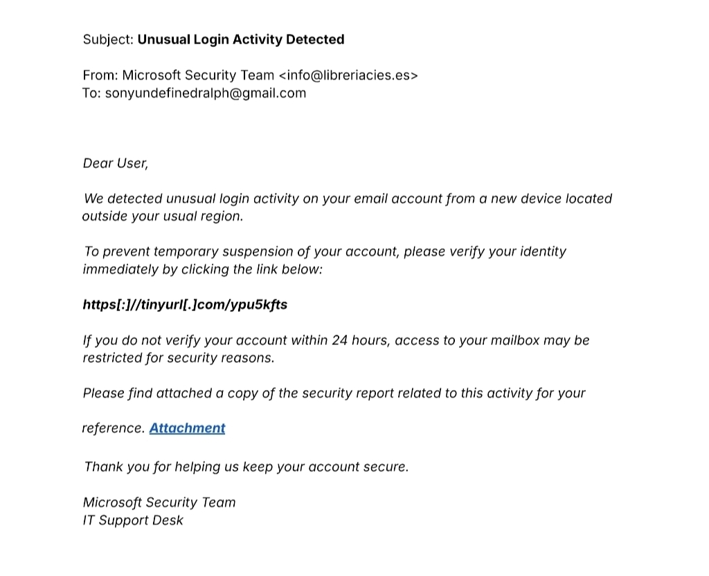
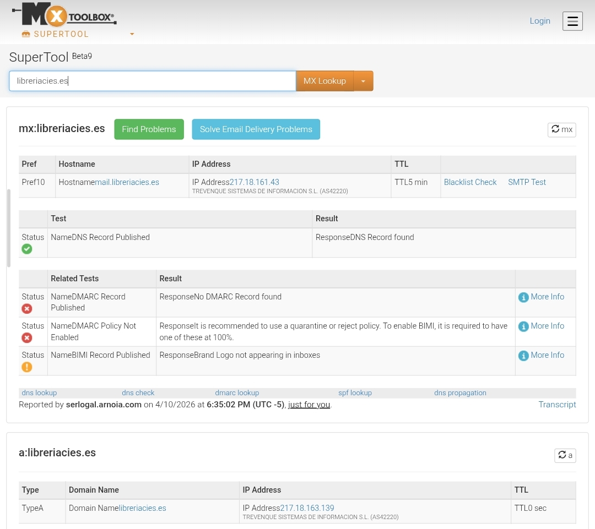
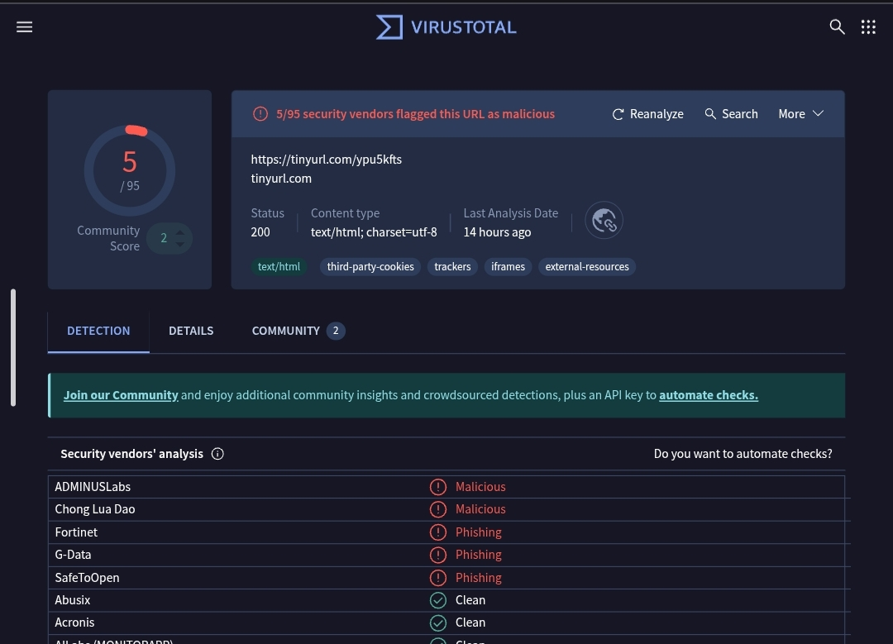

# 🛡️ Case Study: Phishing Analysis - Incident Response

## Objective
Conducted a technical investigation of a suspicious "Microsoft" security alert to identify potential threats and determine the legitimacy of communication.

---

## 🔍 Methodology & Key Findings

### 1. Indicators of Compromise (IoC) Identification
* **Sender Address:** Flagged a critical discrepancy between the branding (Microsoft Security Team) and the actual sending infrastructure (`info@libreriacies[.]es`).
* **TLD Anomaly:** The `.es` (Spain) TLD for a "Microsoft" email is a high-confidence IoC. Official alerts originate from verified domains like `@accountprotection.microsoft.com`.
* **Malicious URL:** Identified the use of a URL shortener (`tinyurl[.]com`) used to mask the final destination and bypass automated email filters.
* **Psychological Trigger:** Recognized social engineering tactics, including artificial urgency ("within 24 hours") and threats of account suspension.

### 2. Technical Domain & URL Analysis
* **MxToolbox Verification:** Analyzed the sender IP `217.18.163.139`. Identified `libreriacies[.]es` as a **legitimate but compromised asset**.
* **Authentication Weaponization:** The attacker leveraged the bookstore's valid SPF/DKIM configuration to deliver a fraudulent payload that appears technically "clean" to basic scanners.
* **VirusTotal Validation:** Performed a multi-engine scan of the embedded TinyURL. The link was flagged as **Malicious/Phishing** by multiple security vendors.

### 3. Evidence Screenshots

#### Original Phishing Email Analysis

#### MxToolbox Reputation Results

#### VirusTotal Analysis

---

## 🏁 Conclusion & Recommendations
**Classification:** `Confirmed Phishing Incident (Credential Harvesting)`

The attacker's goal was to lure the user to a fraudulent Microsoft login page to steal credentials. This represents a sophisticated attempt to exploit the trust of an established business infrastructure.

### SOC Recommendations:
1. **Immediate Deletion:** Remove the malicious email from the user's inbox.
2. **Domain Blocking:** Block the sender domain at the organizational gateway.
3. **URL Reporting:** Report the malicious TinyURL to the service provider's abuse team for takedown.
   
